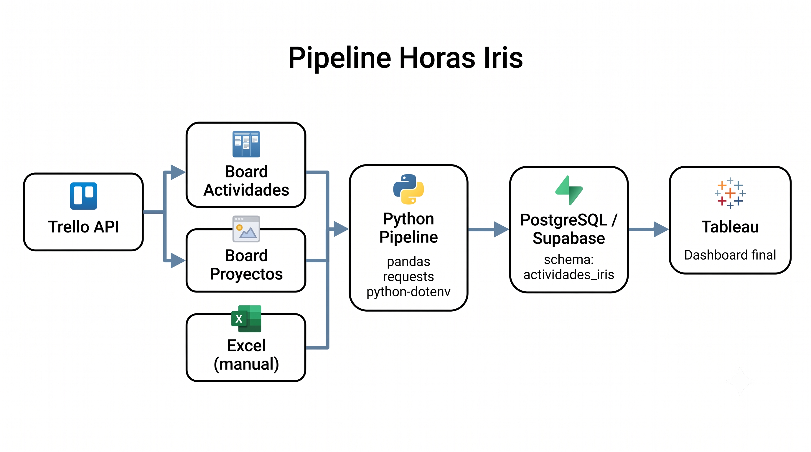
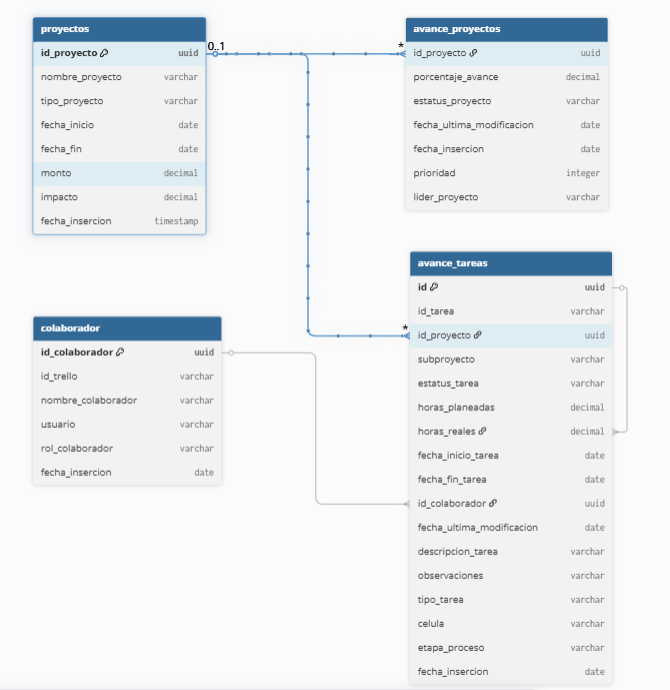

# Pipeline Proyectos y Actividades IRIS


## Objetivo
Pipeline que extrae los proyectos,actividades y horas trabajadas desde **Trello**  y del archivo excel**Actividades IRIS**, normaliza y consolida los datos, carga en **Supabase**  para finalmente presentar la información en un dashboard ejecutivo del Avance de Portafolio de Proyectos IRIS en **Tableau**.

## Diagrama general

El siguiente diagrama muestra la estructura del pipeline de Proyectos y actividades



- **Extracción**: Trello API (Board de proyectos y actividades) + lectura de Excel, el archivo Actividades IRIS 2026.xls se descarga de OneDrive de la ruta [Archivo Actividades](onuris-my.sharepoint.com/:f:/r/personal/196938_onuriscp_com/Documents/IRIS%20StartUp%20Lab/Direcci%C3%B3n/5.2026/04.%20Actividades%20IRIS?csf=1&web=1&e=JBjNg3) y se coloca manualmente en la carpeta del proyecto pipeline_horas_iris>data
- **Normalización**: Limpieza de nombres, acrónimos, formato de fechas, consolidación de duplicados
- **Carga**: Upserts hacia Supabase (PostgreSQL)
- **Dashboard**: Tableau conectado a Supabase (esquema actividades_iris)

## Diagrama de Base de Datos

A continuación se muestra el diagrama de BD inicial del esquema actividades_iris

[Proyectos Iris](https://dbdiagram.io/d/Proyectos-Iris-6a4401d04ac62e474cfd6fe8)




## Requerimientos técnicos

- Python 3.9+
- Anaconda
- Credenciales de Supabase (PostgreSQL vía pooler)
- API Key y Token de Trello

### Variables de entorno adicionales

| Variable | Valores | Descripción |
|---|---|---|
| FULL_RELOAD| "true" / "false"` | true → truncado completo + reinserción; false → upsert incremental |

## Ejecuciones

### Ejecución semanal (incremental, los días Lunes a las 10:00 am)

```powershell
conda activate proyectos_iris
cd pipeline_horas_iris
python -m src.pipeline_actividades_trello
```

### Carga Inicial (trunca y recarga todo)

```powershell
$env:FULL_RELOAD="true"
python -m src.pipeline_actividades_trello
```

## Pipeline paso a paso

### 1. Extracción (pipeline_actividades_trello.py)

- **Trello**: Obtiene tarjetas de los boards configurados en TRELLO_BOARD_IDS (Actividades y Proyectos). Incluye custom fields (fechas, prioridad, % avance, líder, monto, impacto).
- **Excel**: Lee data/Actividades IRIS 2026.xlsx, únicamente la hoja Sheet1.
- **Miembros**: Obtiene el listado de members /boards/{id}/members.

### 2. Unificación (unified_data)

Combina datos de Trello y Excel en un solo DataFrame, identificamos la fuente (fuente_datos = "trello" o "excel").

### 3. Carga (db_loader.py)

| Función | Descripción |
|---|---|
| insert_colaboradores | Inserta/actualiza colaboradores desde Trello (Interno) y Excel (Externo) por id_trello. |
| ensure_all_proyectos |Catálogo del board de proyectos, y proyectos que no estan dados de alta desde tareas. |
| insert_avance_proyectos | Avance de proyectos (% avance, estatus,líder y prioridad). |
| insert_avance_tareas | Inserción o actualización de tareas por id_tarea (solo se pueden actualizan tareas de un mes atrás a la fecha de ejecución). |

### 4. Visualización
El dashboard de Tableau se conectará a estas tablas vía conexión directa a Supabase.


